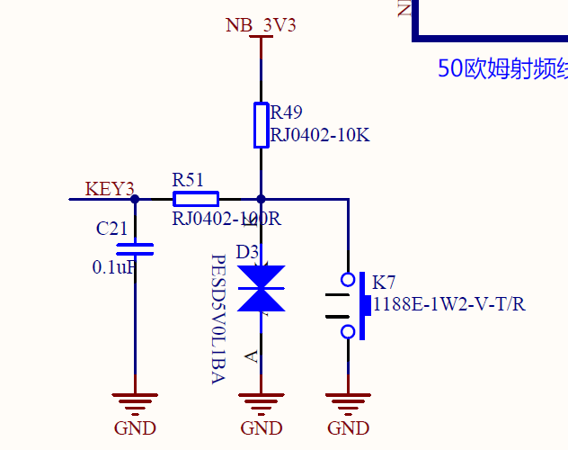
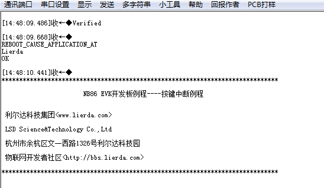

# 按键中断例程

### 1 简介

本例程使用Lierda OpenCPU 库函数实现按键中断例程，对应目录如下：

- ProjectLight
  - src
    - lib
      - Demo

### 2 要点

- GPIO接口函数常规用法
- GPIO中断常规用法

### 3 实验条件

硬件：Lierda NB86 EVK/NB86-G模组  
软件：USB转串口驱动  
集成开发环境：Eclipse  

### 4 电气连接



### 5 实验步骤
5.1 将`ProjectLight`文件夹导入eclipse，导入方法详见[《Lierda NB-IoT模组 OpenCPU DemoCode说明文档》
](../../Doc/基本资料/Lierda_NB-IoT模组OpenCPU_DEMO说明文档V1.8_190403.pdf)

5.2 打开`Demo`文件夹下示例代码：  


5.3 例程详解  
5.3.1 涉及库函数及对应头文件  
- GPIO相关库函数  
头文件：  
`#include "lierdaGPIO.h"`  
库函数：
``` cpp  
void lierdaGPIOInit(void);//GPIO初始化  
bool lierdaGPIOClaim(PIN pin,GPIO_DIRECTION dir);//GPIO声明  
void lierdaGPIORegisterCallback(PIN pin, GPIO_INTERRUPT trigger, GPIO_CALLBACK callback);//GPIO中断声明函数  
bool lierdaGPIORead(PIN pin);//GPIO读取函数  
```

5.3.2 按键驱动

按键按下，相应的引脚为低电平，只需读取相应的IO电平即可，若为低电平按键按下，反之。  
``` cpp
static void sos_key_callback(PIN pin)  
	{  
		if (0==Lierda_KEY_Read(pin))  
		{  
			while (lierdaGPIORead(pin) == 0) ;//等待按键松开  
			LEDx_StateSet(LED10 | LED11 | LED12,LED_TOGGLE); //按键中断来临LED10,LED11,LED12状态改变  
		}  
	}    
```

详见例程中的示例代码。


5.4  编译工程，如没有错误则编译通过：  
  
编译成功后，烧写固件，烧写过程详见[《Lierda NB-IoT模组 OpenCPU DemoCode说明文档》
](../../Doc/基本资料/Lierda_NB-IoT模组OpenCPU_DEMO说明文档V1.8_190403.pdf)

5.5 烧写完毕，打开串口助手，选择AT串口，波特率为9600，可看到如下结果：  


### 6 注意事项

- 在选用GPIO引脚时注意电压域的选择


### 7 参考资料

| 技术论坛 | OpenCPU资料 | NB86 EVK资料
| :----------- | :----------- | :----------- |
| [物联网开发者社区](http://bbs.lierda.com) |  [OpenCPU基本资料集](https://github.com/lierda-nb-iot-team/Lierda_OpenCPU_SDK) |  [NB86 EVK基本资料集](https://github.com/lierda-nb-iot-team/Lierda_NB86_EVK) |