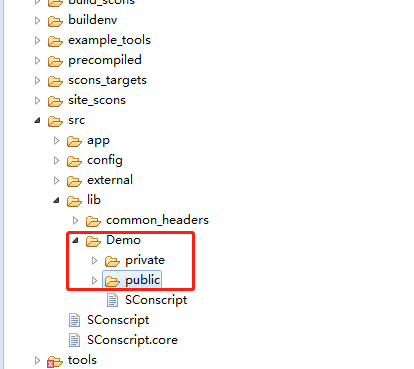
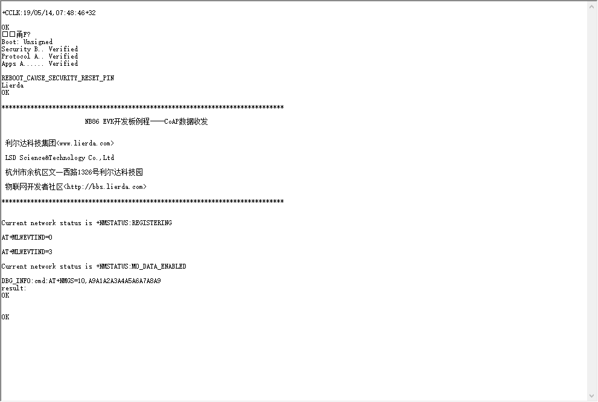

# CoAP数据收发例程

### 1 简介

本例程为CoAP数据收发的例程，对应目录如下：

- ProjectLight
  - src
    - lib
      - Demo

### 2 要点

- CoAP数据收发相关接口的常规用法
- 事件状态获取接口的常规用法  
- 虚拟AT接口的常规用法  

### 3 实验条件

硬件：Lierda NB86 EVK/NB86-G模组  
软件：USB转串口驱动  
集成开发环境：Eclipse  

### 4 电气连接
无  

### 5 实验步骤
5.1 将`ProjectLight`文件夹导入eclipse，导入方法详见[《Lierda NB-IoT模组 OpenCPU DemoCode说明文档》
](../../Doc/基本资料/Lierda_NB-IoT模组OpenCPU_DEMO说明文档V1.8_190403.pdf)
5.2 打开`Demo`文件夹下示例代码：  

5.3 例程详解  
5.3.1 涉及库函数及对应头文件  
- CoAP数据收发相关库函数  
头文件：  
`#include "lierdaNNMIData.h"`  
库函数：  
`lierdaNNMIDataInit();//NNMI下行数据接收初始化`  

`lierdaNNMIDataReceived(nnmi_buff, &nnmi_buff_len, 0xFFFFFFFF); //NNMI下行数据接收`  

- 事件状态获取相关库函数  
头文件：  
`#include "lierda_module_status.h"`  
库函数：  
`lierda_module_status_read();//获取当前与平台的注册状态`  
- 虚拟AT相关库函数  
头文件：  
`#include "lierda_app_main.h"`  
库函数：  
`char * lierdaATCall(char *at_cmd_buf_param, uint16 timeout);//虚拟AT接口`  

5.3.3  编译工程，如没有错误则编译通过：  
  
编译成功后，烧写固件，烧写过程详见[《Lierda NB-IoT模组 OpenCPU DemoCode说明文档》
](../../Doc/基本资料/Lierda_NB-IoT模组OpenCPU_DEMO说明文档V1.8_190403.pdf)
5.3.4 烧写完毕，打开串口助手，选择AT串口，波特率为9600，可看到如下结果：  

### 6 注意事项
使用该例程前，先用AT指令配置一下平台的IP地址，即NCDP。   

### 7 参考资料

| 技术论坛 |
| :----------- |
| [物联网开发者社区](http://bbs.lierda.com) |