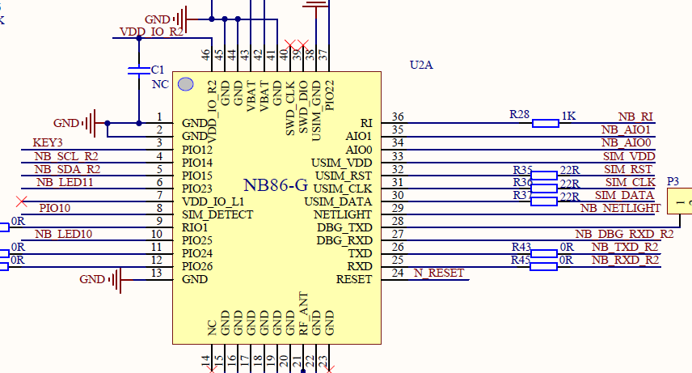
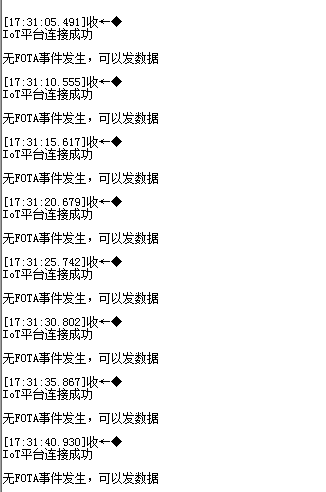

# 网络附着例程

### 1 简介

本例程使用Lierda OpenCPU 库函数实现网络连接及IoT平台连接，方便客户通过配置相关参数就可以连接网络和IoT平台，对应目录如下：

- ProjectLight
  - src
    - lib
      - Demo

### 2 要点

- 网络连接相关接口
- 事件状态相关接口

### 3 实验条件

硬件：Lierda NB86 EVK/NB86-G模组  
软件：USB转串口驱动  
集成开发环境：Eclipse  

### 4 电气连接


### 5 实验步骤
5.1 将`ProjectLight`文件夹导入eclipse，导入方法详见[《Lierda NB-IoT模组 OpenCPU DemoCode说明文档》
](https://github.com/lierda-nb-iot-team/Lierda_OpenCPU_SDK)

5.2 打开`Demo`文件夹下示例代码：  


5.3 例程详解  
5.3.1 涉及库函数及对应头文件
  
- 事件状态相关库函数  
头文件：  
`#include "lierda_module_status.h"`  
库函数:  

```cpp 
void lierda_module_status_read(void);	//用于事件状态更新
```

- 网络连接相关库函数  
头文件：  
`#include "lierda_network_dealwith.h"`  
库函数：
  
```cpp
NET_PARA_RET lierda_net_local_config_init(struct NET_Local_Para *p_local_para);//网络连接参数初始化  
void lierda_network_dealwith_task_enable(void);//网络连接使能
```

5.3.2 网络连接初始化

对相关参数进行初始化，然后对网络连接函数进行使能即可，详细请见代码：void NetConnect_Init(void)函数。


5.4  编译工程，如没有错误则编译通过：  
  
编译成功后，烧写固件，烧写过程详见[《Lierda NB-IoT模组 OpenCPU DemoCode说明文档》
](https://github.com/lierda-nb-iot-team/Lierda_OpenCPU_SDK)

5.5 烧写完毕，打开串口助手，选择AT串口，波特率为9600，可看到如下结果：




### 6 注意事项

- FOTA过程中不能进行发数据操作
- 网络初始化中的参数根据自己的业务逻辑填写

### 7 参考资料

| 技术论坛 | OpenCPU资料 | NB86 EVK资料
| :----------- | :----------- | :----------- |
| [物联网开发者社区](http://bbs.lierda.com) |  [OpenCPU基本资料集](https://github.com/lierda-nb-iot-team/Lierda_OpenCPU_SDK) |  [NB86 EVK基本资料集](https://github.com/lierda-nb-iot-team/Lierda_NB86_EVK) |
