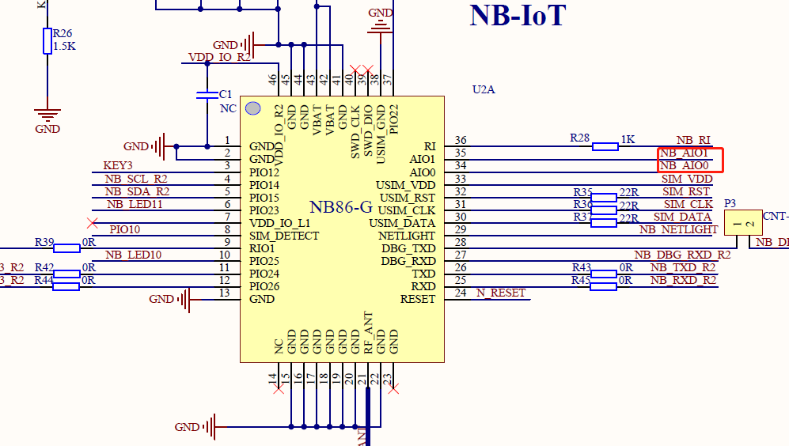
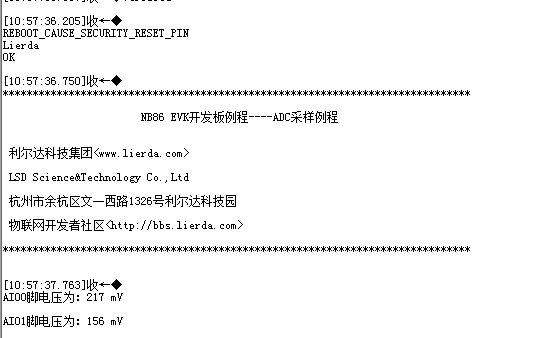

# ADC电压采样例程

### 1 简介

本例程使用Lierda OpenCPU 库函数实现ADC电压采样例程，对应目录如下：

- ProjectLight
  - src
    - lib
      - Demo

### 2 要点

- ADC电压采样接口函数常规用法

### 3 实验条件

硬件：Lierda NB86 EVK/NB86-G模组  
软件：USB转串口驱动  
集成开发环境：Eclipse  

### 4 电气连接

### 5 实验步骤
5.1 将`ProjectLight`文件夹导入eclipse，导入方法详见[《Lierda NB-IoT模组 OpenCPU DemoCode说明文档》
](../../Doc/基本资料/Lierda_NB-IoT模组OpenCPU_DEMO说明文档V1.8_190403.pdf)

5.2 打开`Demo`文件夹下示例代码：  

5.3 例程详解  
5.3.1 涉及库函数及对应头文件  
-ADC采样相关库函数 
头文件：  
`#include "lierdaADC.h"`  
库函数：  
`LIERDA_ADC_RET lierdaADCInit(void);//ADC初始化`
`AIO_FUNC_RET lierdaAIOCalibrateADC(void);//电压校准`
`AIO_FUNC_RET lierdaReadAIOPin(uint32 *voltage, uint8 aio_pin_number);;//AIO口电压采样`

5.3.2 AIO电压采样样例

对AIO采样进行初始化配置，详见例程代码中void AdcSampInit(void)函数。

对AIO电压进行采样，详见例程代码中void AdcSampTest (void)函数。

5.4  编译工程，如没有错误则编译通过：  
  
编译成功后，烧写固件，烧写过程详见[《Lierda NB-IoT模组 OpenCPU DemoCode说明文档》
](../../Doc/基本资料/Lierda_NB-IoT模组OpenCPU_DEMO说明文档V1.8_190403.pdf)

5.5 烧写完毕，打开串口助手，选择AT串口，波特率为9600，可看到如下结果：  

### 6 注意事项

- 使用ADC电压采样前需对ADC进行初始化和校准。

### 7 参考资料

| 技术论坛 |
| :----------- |
| [物联网开发者社区](http://bbs.lierda.com) |