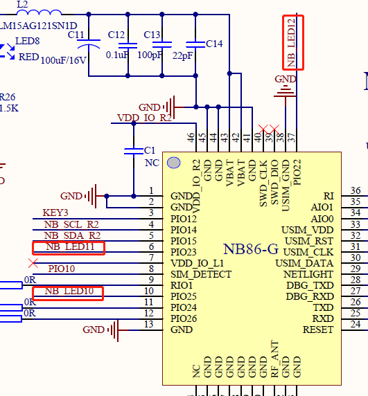
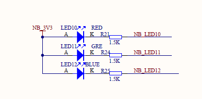
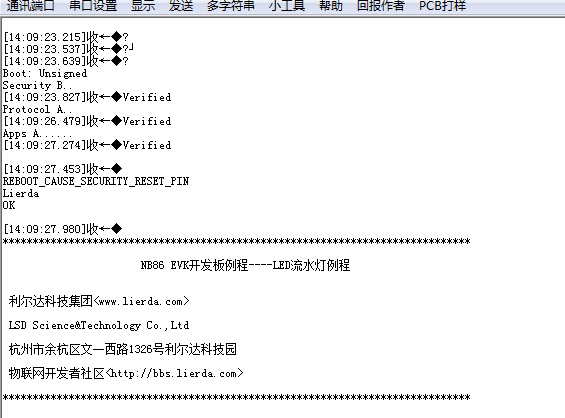

# LED流水灯功能例程

### 1 简介

本例程使用Lierda OpenCPU 库函数实现LED流水灯效果，对应目录如下：

- ProjectLight
  - src
    - lib
      - Demo

### 2 要点

- GPIO接口函数常规用法
- 软件定时器接口函数常规用法
- LED灯简单控制

### 3 实验条件

硬件：Lierda NB86 EVK/NB86-G模组  
软件：USB转串口驱动  
集成开发环境：Eclipse  

### 4 电气连接



### 5 实验步骤
5.1 将`ProjectLight`文件夹导入eclipse，导入方法详见[《Lierda NB-IoT模组 OpenCPU DemoCode说明文档》
](../../Doc/基本资料/Lierda_NB-IoT模组OpenCPU_DEMO说明文档V1.8_190403.pdf)

5.2 打开`Demo`文件夹下示例代码：  


5.3 例程详解  
5.3.1 涉及库函数及对应头文件  
- GPIO相关库函数  
头文件：  
`#include "lierdaGPIO.h"`  
库函数:  
``` cpp  
void lierdaGPIOInit(void);//GPIO初始化  
bool lierdaGPIOClaim(PIN pin,GPIO_DIRECTION dir);//GPIO声明  
void lierdaGPIOSet(PIN pin);//GPIO拉高  
void lierdaGPIOClear(PIN pin);//GPIO拉低   
```  
- 软件定时器相关库函数  
头文件：  
`#include "cmsis_os2.h"`  
库函数： 
 ``` cpp  
osTimerId_t osTimerNew (osTimerFunc_t func, osTimerType_t type, void *argument, const osTimerAttr_t *attr);//软件定时器创建  
osStatus_t osTimerStart (osTimerId_t timer_id, uint32_t ticks);//软件定时器启动  
osStatus_t osTimerStop (osTimerId_t timer_id);//软件定时器停止  
```  
5.3.2 LED灯驱动

打开灯只需让相应的GPIO引脚输出低电平即可：  
``` cpp 
 #define LED10_ON lierdaGPIOClear(LED_10) 
```  
关闭灯只需让相应的GPIO引脚输出高电平即可：  
``` cpp  
 #define LED10_OFF lierdaGPIOSet(LED_10)  
```  
详见例程中的示例代码。

5.4  编译工程，如没有错误则编译通过：  
  
编译成功后，烧写固件，烧写过程详见[《Lierda NB-IoT模组 OpenCPU DemoCode说明文档》
](../../Doc/基本资料/Lierda_NB-IoT模组OpenCPU_DEMO说明文档V1.8_190403.pdf)

5.5 烧写完毕，打开串口助手，选择AT串口，波特率为9600，可看到如下结果：  


### 6 注意事项

- 在选用GPIO引脚时注意电压域的选择
- 尽量不创建10ms以下的软件定时器


### 7 参考资料

| 技术论坛 | OpenCPU资料 | NB86 EVK资料
| :----------- | :----------- | :----------- |
| [物联网开发者社区](http://bbs.lierda.com) |  [OpenCPU基本资料集](https://github.com/lierda-nb-iot-team/Lierda_OpenCPU_SDK) |  [NB86 EVK基本资料集](https://github.com/lierda-nb-iot-team/Lierda_NB86_EVK) |